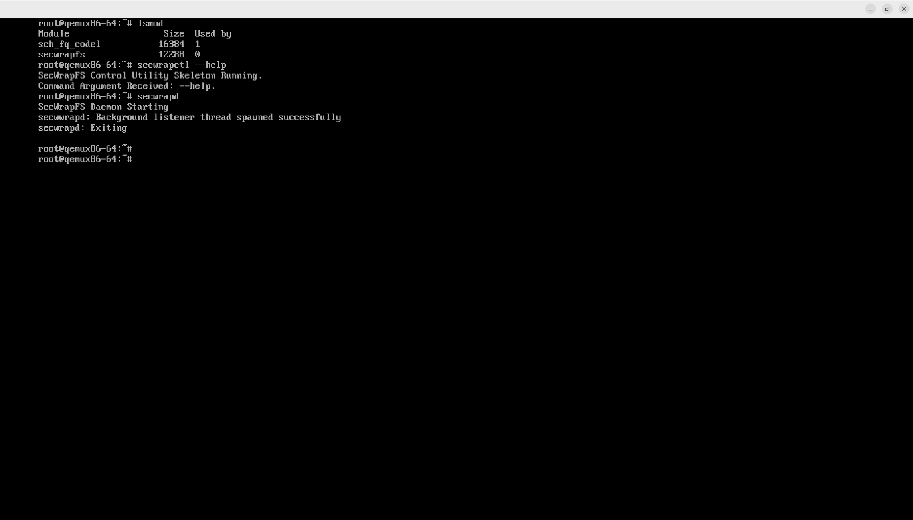

# SecWrapFS: Secure, Time-Audited Stackable Virtual File System

## Table of Contents
1. [Project Overview](#project-overview)
2. [Building SecWrapFS](#bulilding-the-secwrapfs)

## Project Overview
The goal of this project is to implement a secure, time-audited, and dynamic file-system filtering layer by creating a modified version of **SecWrapFS** (a stackable cryptographic/logging virtual filesystem based on WrapFS) deployed on a Raspberry Pi 4 using Yocto. For complete architecture diagrams, target specifications, and implementation details, please see the full [Project Overview Page](https://github.com/iniyanr/aesd-final-project-iniyanr/wiki/Project-Overview)

## Building the SecWrapFS
To build the SecWrapFS follow the steps in this documentation : [Building the SecWrapFS](https://github.com/iniyanr/aesd-final-project-iniyanr/wiki/Building-the-SecWrapFS)
